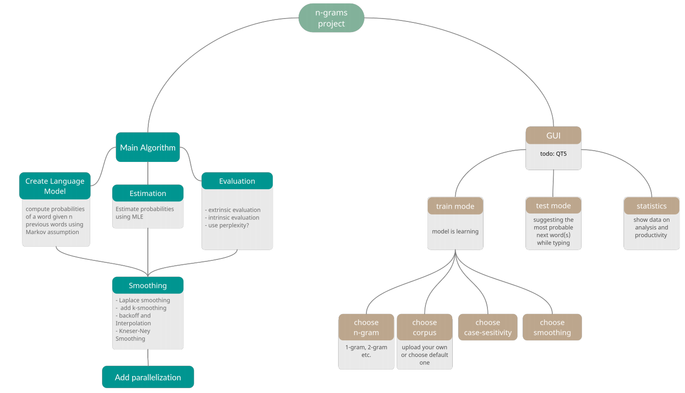
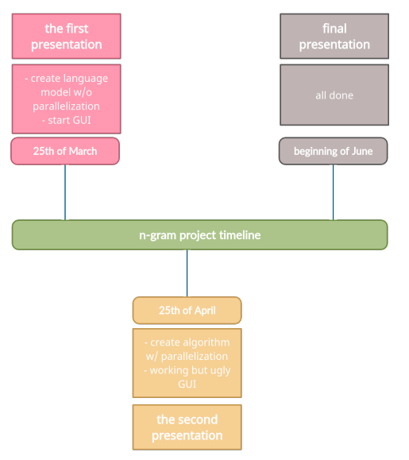

# Word prediction system based on n-gram

## Project details
### Aim
Our goal is to create parallel system to predict the next word while typing text based on concept of n-gram.
 
### Structure

### Project timeline

## Contributors
* [Romanyshyn Natalia](https://github.com/romanyshyn-natalia)
* [Korabliova Anna](https://github.com/anika02)
* [Hromyak Diana](https://github.com/Diana-Doe)
* [Myntiuk Sofiia](https://github.com/sophmintaii)
